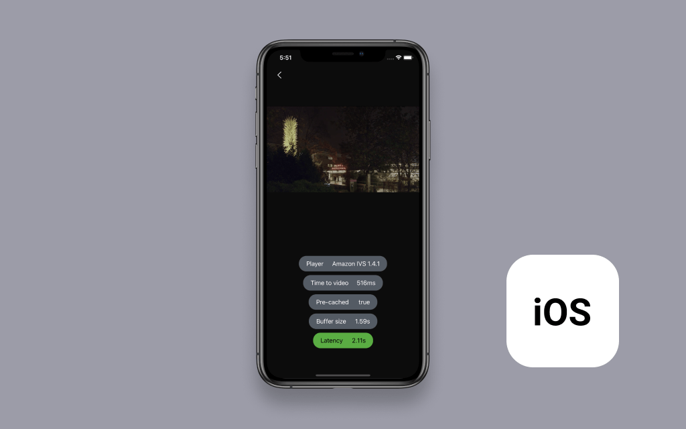

# Amazon IVS Optimizations iOS Demo

This standalone demo aims to showcase best practices and optimizations to achieve reduced TTV (Time to Video) and improved latency with Amazon IVS.

The demo app displays a list of optimization options, each opening a simple player view, with pills offering information and feedback.

## Setup

1. Clone the repository to your local machine.
2. Install the SDK dependency using CocoaPods. This can be done by running the following commands from the repository folder:
   * `pod install`
   * For more information about these commands, see [Bundler](https://bundler.io/) and [CocoaPods](https://guides.cocoapods.org/using/getting-started.html).
3. Open amazon-ivs-optimizations-ios-demo.xcworkspace.
4. You can now build and run the projects in the simulator.

## Using Your Amazon IVS Stream

**IMPORTANT NOTE:** Using your own stream will create and consume AWS resources, which will cost money.

By default, the app loads a demo live stream. By tapping on the cog icon in the app, you can open the settings view and modify the live stream that the app loads.

1. If you do not have an Amazon IVS Channel, create and set up an Amazon IVS channel. A guide is available here: [Getting started with Amazon IVS](https://docs.aws.amazon.com/ivs/latest/userguide/GSIVS.html).
2. Open the [Amazon IVS Console](https://console.aws.amazon.com/ivs) and navigate to the channel you would like to use.
3. Copy the channel's _Playback URL_ from the [Amazon IVS Console](https://console.aws.amazon.com/ivs)
4. Run the application.
5. Tap the cog icon in the top-right corner to open the app settings.
6. Tap the toggle next to _Use custom live stream_ to enable it.
7. Paste the playback URL in the text field in the app. If you are running the app in the iOS Simulator, click and hold on the field until the paste button appears.
8. Tap the arrow in the top-left corner to return to the home screen and select one of the demos to load.

Note that you must be streaming content to your channel in order for video to appear in the app.

## License
This project is licensed under the MIT-0 License. See the LICENSE file.
